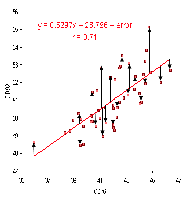

My Rough notes on machine learning with TF and SciKitLearn

**Chapter 1**

Oh Yeah, Some people picturize a robot when they hear machine learning! And by downloading Wikipedia onto my system it doesnt become smart! 

The art of programmer to learn from data!

Why using machine learning ?

1. Traditional approach as a computer program needs rules to be written and then we can infer from it, but ML is trained on data.
1. Supervised ML -> It includes the desired solutions called labels. 
2. Unsupervised ML ->Unlabelled data , system tries to learn without a teacher.
3. SemiSupervised. -> some labelled data and a lot of unlabelled data. ForEx: Google Photos.
4. Reinforcement learning -> An agent observes the environment select and perform actions and get rewards or penalties in return , a policy is defined. For Ex; Robots learn by using RF learning.
5. Batch and online learning.

**Chapter 2**

When learning ML its best to experiment with real data and not artificial datasets. There are thousands of open datasets to choose from. Like kaggle, AWS datasets , google cloud open datasets.

**California housing prices dataset!**

Building a model is not the problem! How are we going to use it to solve our purpose ? 

X is a vector of all the feature values of the i’th instance in the dataset.

x  = [  latitude =  119.33     longit = 33     inhabitants= 1,146    income = 38,8373 ] 

Y = House value $ 156,400

**RMSE - Root mean square error** is the preferred cost function. (how far from the deviation line the data points are!) the deviation line or the line of best fit.

[https://www.statisticshowto.datasciencecentral.com/probability-and-statistics/regression-analysis/](https://www.statisticshowto.datasciencecentral.com/probability-and-statistics/regression-analysis/)

>>>>>  gd2md-html alert: inline image link here (to images/Rough-notes0.png). Store image on your image server and adjust path/filename if necessary.  (<a href="#">Back to top</a>)(<a href="#gdcalert2">Next alert</a>) >>>>> 

But in some cases, we use **mean absolute error **too MAE like for outlier districts.

**Create the workspace **

**➜  ~ mkdir ml**

**➜  ~ cd ml**

**➜  ml pip3 install virtualenv**

**➜  ml virtualenv env**

**(env) ➜  ml pip3 install --upgrade jupyter matplotlib numpy pandas scipy scikit-learn**

**Fire up jupyter notebook!**

**(env) ➜  ml jupyter notebook**

**Create a python3 notebook **

>>>>>  gd2md-html alert: inline image link here (to images/Rough-notes1.png). Store image on your image server and adjust path/filename if necessary.  (<a href="#">Back to top</a>)(<a href="#gdcalert3">Next alert</a>) >>>>> 

**https://github.com/Anmol92verma/MLLearningAndNotes**